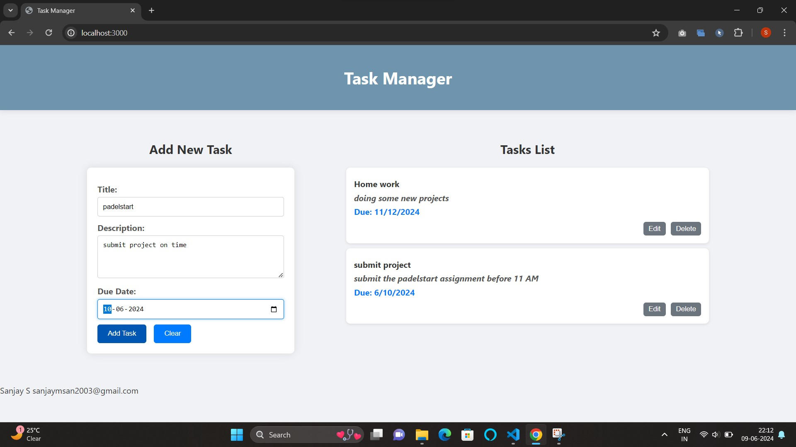

TASK MANAGEMENT APP

Technologies
Frontend: HTML, CSS, JavaScript
Backend: Node.js, Express.js, MongoDB, Mongoose, Body-Parser, Cors

To run the application locally 
1. clone git repository.
2. make sure you are connected to mongoDb databse named curd and collection named users.
3. Install the required dependencies:
     npm install
4. Run the Node.js server using the command:
     npm run dev
5. open locallhost on your web browser to access the application.